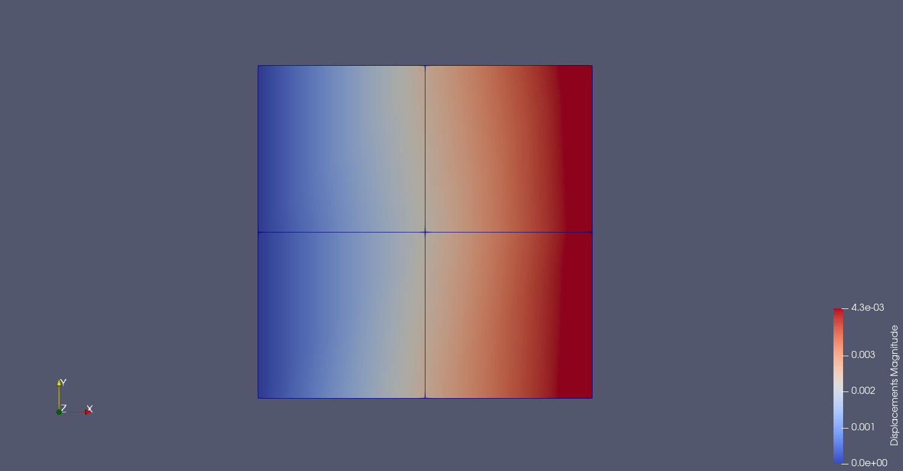
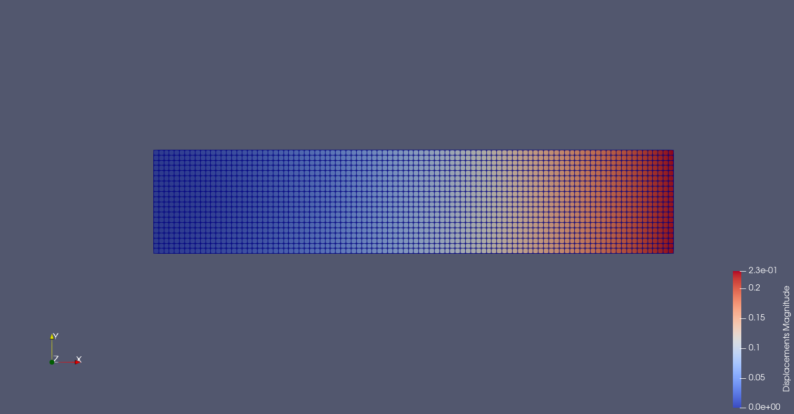
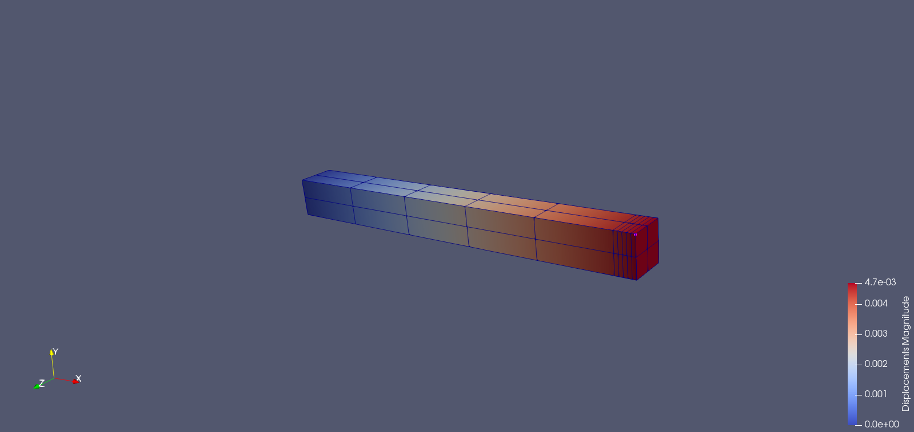
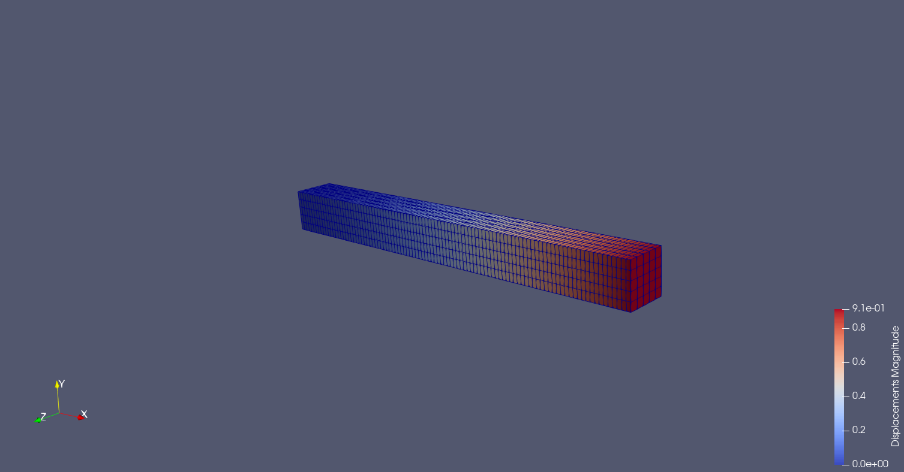

# Examples

This page contains description of examples of FEM project which can be found in `examples`
folder. To run example you can use appropriate block of code in `Examples.jl`.

## SmallPlate

2D square plate, ``100 \times 100`` mm. Mesh in this case is pretty simple: 4 
evenly distributed elements.

### Tasks

- **Task**. Plate is fixed at one side and is stretched at the opposite one. Type of finite 
    element model: plain stress.

## Beam

2D beam, ``20 \times 100`` mm. Mesh consists of 2000 elements which are evenly distributed
over the beam.

### Tasks

- **Task**. Beam is fixed at one side and is stretched at the opposite one. Type of finite 
    element model: plain stress.

## Beam3D. Small task
3D beam, ``10 \times 10 \times 100`` mm. Mesh consists of 40 elements. On the end of beam 
mesh refinement is presented.

### Tasks

- **TaskStretch**. Beam is fixed at one side. On the opposite side pressure is applied to
    the end of beam.

## Beam3D. Big task

3D beam, ``10 \times 10 \times 100`` mm. Mesh consists of 2500 elements which are evenly
distributed over the beam.

### Tasks

- **TaskBind**. Beam is fixed at one side. On the oppsite side pressure is applied to the 
    top of beam.
